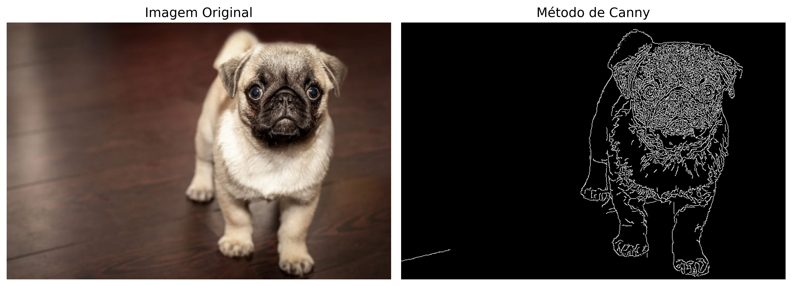
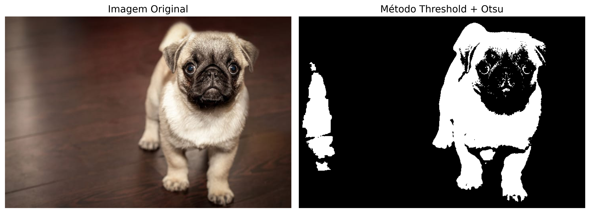

# Detecção de Bordas e Segmentação
**Autor:** Murilo Rocha

## 1. Introdução

**Detecção de Bordas** e **Segmentação** são duas técnicas fundamentais em processamento de imagens e Visão Computacional, cada uma com sua própria finalidade e metodologia. Ambas desempenham um papel crucial na extração de informações significativas das imagens, facilitando uma variedade de aplicações práticas.

## 2. Detecção de Bordas

A Detecção de Bordas foca em identificar os pontos em uma imagem digital onde o brilho ou a intensidade da imagem muda significativamente ou, mais formalmente, torna-se descontínua. As bordas em uma imagem indicam transições e mudanças abruptas nas intensidades de pixel e são fundamentais para compreender características da imagem, como formas, contornos e texturas.

### 2.1 Método Canny

O **Detector de Bordas de Canny** é renomado por sua eficácia em identificar bordas finas e sua robustez na eliminação de ruídos. Este algoritmo, que procede em múltiplas etapas, é amplamente adotado por sua habilidade em ressaltar bordas importantes, ao mesmo tempo em que preserva a precisão. Contudo, uma das limitações do método Canny reside na sua sensibilidade a variações de ruído e ao seu custo computacional considerável.

Para atenuar a sensibilidade do detector de bordas de Canny a variações de ruído e adaptar os limiares de maneira automática às características específicas da imagem, o conceito de mediana é aplicado para determinar os limiares inferior e superior. Este método baseia-se na distribuição das intensidades dos pixels da imagem, utilizando a mediana como um ponto de referência para ajustar os limiares de forma que sejam representativos para a detecção de bordas na imagem específica.

A determinação dos limiares inferior e superior é feita através das seguintes expressões matemáticas:

- **Limiar Inferior**: `limiar_inferior = int(max(0, (1.0 - 0.33) * mediana))`
- **Limiar Superior**: `limiar_superior = int(min(255, (1.0 + 0.33) * mediana))`

Onde `mediana` é o valor mediano das intensidades dos pixels da imagem. O fator `0.33` é utilizado para ajustar a mediana, criando um intervalo dinâmico para os limiares que se adapta ao contraste e ao nível de ruído da imagem. O limiar inferior é calculado como 67% (aproximadamente `1.0 - 0.33`) da mediana, considerando-se um piso de `0` para garantir que o valor não seja negativo. O limiar superior é fixado em 133% (aproximadamente `1.0 + 0.33`) da mediana, com um teto de `255` para assegurar que o valor não exceda o máximo possível de intensidade em uma imagem de 8 bits. Este método proporciona uma abordagem adaptativa e automática para definir os limiares, otimizando a detecção de bordas em diversas condições de imagem.

## 3. Segmentação

A Segmentação visa dividir uma imagem em regiões que compartilham características semelhantes, como cor, intensidade ou textura. Este processo facilita a identificação de objetos e limites na imagem, sendo fundamental em diversas aplicações de análise de imagens.

### 3.1 Método de Segmentação Baseada em Limiarização (Thresholding) + Otsu

O <strong>Método de Segmentação Baseada em Limiarização</strong>, conhecido como Thresholding, é uma técnica de segmentação de imagens caracterizada por sua simplicidade e rapidez. Ela opera definindo um valor de limiar, que serve para segmentar a imagem em diferentes partes com base nesse critério. <strong><i>Pontos fortes:</i></strong> Este método é particularmente eficaz em imagens com alto contraste, graças à sua implementação direta e eficiente. <strong><i>Pontos fracos:</i></strong> No entanto, enfrenta limitações quando aplicado a imagens que apresentam variações sutis de intensidade ou iluminação não uniforme, onde sua eficiência pode ser significativamente reduzida.

Uma evolução significativa do método tradicional de thresholding é o uso do <strong>Método de Otsu</strong>, que busca otimizar a segmentação automaticamente. Diferentemente do thresholding convencional, que requer a definição manual de um valor de limiar, o Método de Otsu calcula este valor de forma automática. Ele funciona analisando o histograma da imagem e escolhendo um valor que minimiza a variação intraclasse, sendo especialmente eficaz em imagens com distribuição bimodal de intensidade. Esse método torna o processo de segmentação mais robusto e menos suscetível a variações de iluminação ou contraste.

## 4. Conclusão

Embora sejam processos distintos, a detecção de bordas e a segmentação frequentemente se complementam em aplicações de processamento de imagens. As bordas detectadas podem ser utilizadas como uma etapa preliminar na segmentação, ajudando a definir claramente os limites dos objetos. Juntas, elas são componentes essenciais para a interpretação e análise de imagens digitais em variados campos da ciência e tecnologia.
